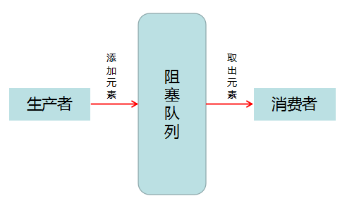
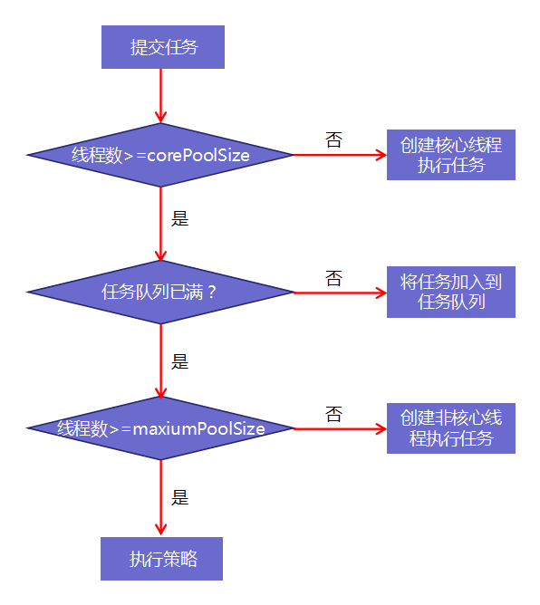

[toc]

# 一、多线程基础

## 线程与进程

1. 进程是程序在一个数据集合上运行的过程，是系统进行资源分配和调度的基本单元。进程可以看做程序的实体，它也是线程的容器。
2. 线程是操作系统调度的最小单元，在一个进程中可以穿件多个线程，这些线程拥有各自的计数器，堆栈和局部变量，并且能够访问共享的内存变量。

3. 使用多线程的意义
   - 使用单独线程完成耗时操作
   - 线程的创建和切换开销小，而且多线程数据共享效率高
   - 充分利用多核 CPU 的资源

## 线程的状态

6种状态：

- New：新创建，还没有调用 Start() 方法
- Runnble：可运行状态，调用Start()方法后进入。该状态下线程可能正在运行也可能没有运行，取决于系统给线程提供的时间
- Blocked：阻塞状态，被锁阻塞，暂不活动
- Waiting：等待状态，线程暂不活动，等待线程调度器重新激活它
- Timed Waiting：超时等待状态，指定时间返回
- Terminated：终止状态，当前线程执行完毕。有两种情况进入终止状态，一是run()方法走完，二是因没有捕获的异常导致run()方法结束


## 创建线程

一般有三种方法，一般推荐使用第一种

1. 实现 Runnble 接口
   - 自定义类实现 Runnble 接口，并实现 run() 方法
   - Thread thread = new Thread(自定义 Runnble 对象)
   - thread.start()

2. 继承 Thread 类，重写 run() 方法

3. 实现 Callable 接口，重写 call() 方法

## 线程中断

Thread.interrupt() 方法用来请求中断线程，当一个线程调用 interrupt() 方法后，线程中断标识位置为true，线程不断检测该标识位。

Thread.interrupted() 方法用来对中断标识位复位。

如果一个线程被阻塞，就无法判断中断状态。如果一个线程处于阻塞状态，线程在检查中断标识位为 true，就会将其复位为false，并在阻塞方法处抛出 InterruptedException 异常。

中断的线程不一定会终止，这只是为了引起线程的注意。大部分线程会将中断作为终止的请求，被中断的线程可以自己决定是否终止。

捕获 InterruptedException 之后不要不做处理，最好让方法抛出给调用者。

## 安全终止线程

1. 使用中断来终止线程

```java
public void run(){
	while(!Thread.isInterrupted()){
		...
	}
}
```

2. 使用 volatile 修饰的 boolean 变量


# 二、同步 

如果两个线程存取相同的对象，并且每一个线程都调用修改该对象的方法，这种情况通常被称为==竞争条件==。

对于竞争的对象，当一个线程需要使用这个资源时，我们添加一把锁，使用完之后锁交给其他线程。

## 重入锁

重入锁 ReentrantLock 是支持重进入的锁，支持一个线程对资源重复加锁。

```java
Lock mLock = new ReentrantLock();
mLock.lock();
try {
    ...
}
finally {
    mLock.unlock();
}
```

该结构确保同一时刻只有一个线程进入临界区，临界区就是同一时刻只能有一个任务访问的代码区。finally 中解锁是必要的，否则发生异常会导致需要该资源的线程被阻塞。

## 条件对象

有时进入临界区发现需要满足某一条件后，代码才能执行。这时可以用条件对象来管理已经获得锁但是不能工作的线程。

## 同步方法

从 Java1.0 开始，Java 中的每一个对象都有一个内部锁。如果一个方法用 synchronized 关键字声明，那么对象的锁将保护整个方法。也就是说，线程要调用同步方法，，必须获得内部的对象锁。

## 同步代码块

同步代码块非常脆弱，不推荐使用。

```java
synchronized(mObj) {
    // 对mObj 的操作
}
```

## volatile

同步锁可以保证线程安全，但是开销较大，volatile 是一种轻量级的解决方式。了解 volatile 之前需要了解内存模型和三特性。

### 1. Java 内存模型

Java 内存模型定义了线程和主内存之间的抽象关系：线程之间的共享变量保存在主内存之中，每个线程都有一个私有的本地内存，本地内存中存储着共享变量的副本。


线程 A 和线程 B 之间的通信，步骤如下：

1. 线程 A 把本地内存中的变量 n 的副本更新，然后刷到主内存中
2. 线程 B 到主内存中去读取线程 A 之前更新过的变量 n

### 2. 原子性

对基本数据类型变量的读取和复制操作是原子性操作，即这些操作是不可被中断的，要么执行完毕，要么不执行。

```java
x = 3; // 原子性操作
y = x; // 2个原子性操作：1.读x的值；2.把x的值写到y
x++; // 3个原子性操作：1.读x的值；2.求x的值+1；3.把值写到x
```

java.util.concurrent.atomic 包下的很多类使用了一些高级机器指令（没有使用锁）保证了其他操作的原子性，比如 AtomicInteger 提供的 incrementAndGet() 方法。

### 3. 可见性

一个线程修改的结果，另一个线程马上就能看到。volatile 关键词修饰的变量具有可见性，一但值被修改，立刻会刷新到主存中。

### 4. 有序性

Java 内存模型允许编译器和处理器对指令进行重排序，虽然重排序过程不会影响到单线程执行的正确性，但是会影响到多线程并发执行的正确性。使用 volatile 或者 synchronized、Lock 都可以保证有序性。

### 5. volatile

volatile 保证了线程之间的可见性和有序性。

volatile 不能保证原子性。

### 6. 正确使用 volatile

synchronized 可以防止多个线程同时执行一段代码，但是比较影响效率。volatile 性能要优于 synchronized，但是也无法完全替代 synchronized，因为 volatile 无法保证原子性。当符合以下2个条件时，我们可以使用 volatile：

1. 对变量的写操作不依赖与当前值
2. 改变量没有包含在具有其他变量的不变式中

> 不变式：一个程序执行过程中永远保持成立的条件

第一个条件就是不能做自增自减操作，第二个条件就是不能与其他变量一起充当 if、while 的条件。

使用 volatile 的场景：

1. 状态标志，做 flag 使用
2. double check

volatile 只能保证可见性和有序性，无法保证原子性，所以是一种比较脆弱的同步机制，只能在符合使用条件的情况下使用， 除了以上场2个使用场景外，推荐使用 synchronized。

# 三、阻塞线程

## 简介

阻塞队列常用于生产者和消费者的场景，生产者是往队列中添加元素的线程，消费者是从队列中拿元素的线程，阻塞队列就是生产者存放元素的容器，而消费者也只从容器里拿元素。



### 常见的阻塞队列场景

1. 队列中没有数据的情况下，消费者线程都会自动阻塞（挂起），直到有数据放入队列
2. 队列中填满数据的情况下，生产者线程都会自动阻塞（挂起），直到队列中有空的位置

支持这两种阻塞场景的队列被称为阻塞队列

### BlockingQueue 的核心方法

- offer(obj)：表示如果可能，将 obj 加入队列中，本方法不阻塞当前线程
- offer(obj, timeOut, timeUnit)：将 obj 加入队列中，有超时时间
- put(obj)：将 obj 加入队列中，如果 BlockingQueue 没有空间导致失败，将会阻塞当前线程，并在 BlockingQueue 有空间后在继续
- poll(time)：取走队首的对象，如果不能去除，有超时时间
- take()：取出队首的对象，如果 BlockingQueue 为空，阻塞当前进程，进入等待状态，直到队列中有数据
- drainTo()：一次性从 BlockingQueue 中取出所有数据，效率高，无需多次分批加锁和释放锁

## Java 中的阻塞队列

在 Java 中提供了7个阻塞队列：

- ArrayBlockingQueue：由数组结构组成的有界阻塞队列。
- LinkedBlockingQueue：由链表结构组成的有界阻塞队列。
- PriorityBlockingQueue：支持优先级排序的无界阻塞队列。
- DelayQueue：使用优先级队列实现的无界阻塞队列。
- SynchronousQueue：不存储元素的阻塞队列。
- LinkedTransferQueue：由链表结构组成的无界阻塞队列。
- LinkedBlockingDeque：由链表结构组成的双向阻塞队列。

### ArrayBlockingQueue

用数组实现的有界阻塞队列，并按照先进先出原则进行排序。可以设置是否线程公平访问队列。

**公平访问队列**就是指阻塞的所有生产者和消费者的线程，当队列可用时，可以按照阻塞的先后顺序进行访问。

### LinkedBlockingQueue

基于链表的阻塞队列，按照先进先出原则排序，内部维持着一个数据缓冲队列（由链表构成）。可以通过制定容量大小，默认大小是 Integer.MAX_VALUE。

### PriorityBlockingQueue

支持优先级的无界队列，默认情况下将元素按自然顺序排序。可以通过自定义实现 compareTo() 方法指定元素排序规则，也可以在初始化 PriorityBlockingQueue 时，指定构造参数 Comparator 来对元素进行排序。

### DelayQueue

支持延时获取元素的无界阻塞队列。队列使用 PriorityQueue 实现。队列中的元素必须实现 Delayed 接口。创建元素时，可以制定元素到期时间，只有在元素到期时才能从队列中取走。

### SynchronousQueue

这是一个不存储元素的阻塞队列。每个插入操作必须等待另一个线程的移除操作，同样任何一个移除操作都必须等待另一个线程的插入操作。因此对列内部其实没有一个元素，或者说容量是 0。严格来说这不是一个队列，因为他没有容量，不能进行 peek 操作（返回队列的头元素）。


## 阻塞队列实现原理

以 ArrayBlockingQueue 为例：

```java
public class ArrayBlockingQueue<E> extends AbstractQueue<E>
        implements BlockingQueue<E>, java.io.Serializable {
    private static final long serialVersionUID = -817911632652898426L;
    final Object[] items;
    // items index for next take, poll, peek or remove
    int takeIndex; 
    // items index for next put, offer, or add
    int putIndex;
    int count;
    final ReentrantLock lock;
    private final Condition notEmpty;
    private final Condition notFull;
}
```

ArrayBlockingQueue 维护了一个 Object 类型的数组 items，takeIndex 代表队首元素的下标，putIndex 代表队尾元素的下标，count 表示队列中元素的个数，lock 是一个重入锁，notEmpty 和 notFull 是等待条件。

分析关键方法 put()：

```java
public void put(E e) throws InterruptedException {
    Objects.requireNonNull(e);
    final ReentrantLock lock = this.lock;
    lock.lockInterruptibly();
    try {
        while (count == items.length) {
            notFull.await();
        }
        enqueue(e);
    } finally {
        lock.unlock();
    }
}
```

put() 方法首先获取了锁，并且是一个可中断锁。如果当前元素个数等于数组长度，则调用 notFull.await() 等待，被其他线程唤醒后，调用 enqueue(e) 插入元素，解锁。

enqueue(e) 方法：

```java
private void enqueue(E x) {
    // assert lock.getHoldCount() == 1;
    // assert items[putIndex] == null;
    final Object[] items = this.items;
    items[putIndex] = x;
    if (++putIndex == items.length) {
        putIndex = 0;
    }
    count++;
    notEmpty.signal();
}
```

插入数据成功后，通过 notEmpty 唤醒消费者线程。

take() 方法：

```java
public E take() throws InterruptedException {
    final ReentrantLock lock = this.lock;
    lock.lockInterruptibly();
    try {
        while (count == 0) {
            notEmpty.await();
        }
        return dequeue();
    } finally {
        lock.unlock();
    }
}
```

与 put 方法类似，take() 方法获取了一个可中断锁，当队列中没有元素是，调用 notEmpty.await() 等待，有元素后调用 dequeue() 取出元素，然后释放锁。

dequeue() 方法：

```java
private E dequeue() {
    // assert lock.getHoldCount() == 1;
    // assert items[takeIndex] != null;
    final Object[] items = this.items;
    @SuppressWarnings("unchecked")
    E x = (E) items[takeIndex];
    items[takeIndex] = null;
    if (++takeIndex == items.length) {
        takeIndex = 0;
    }
    count--;
    if (itrs != null) {
        itrs.elementDequeued();
    }
    notFull.signal();
    return x;
}
```

取出元素后，调用 notFull.signal() 唤醒生产者线程。

## 阻塞线程使用场景

1. 线程池的实现
2. 生产者-消费者模式，使用阻塞队列实现无需单独考虑同步和线程间通信，比使用 Object.wait() 和 Object.notify() 实现要简单很多。

```java
public class Test {

    private int queueSize = 10;
    private ArrayBlockingQueue queue = new ArrayBlockingQueue<Integer>(queueSize);

    public static void main(String[] args) {
        Test test = new Test();
        Producer producer = test.new Producer();
        Consumer consumer = test.new Consumer();
        producer.start();
        consumer.start();
    }

    class Consumer extends Thread {
        @Override
        public void run() {
            while (true) {
                try {
                    queue.take();
                } catch (InterruptedException e) {
                    e.printStackTrace();
                }
            }
        }
    }

    class Producer extends Thread {
        @Override
        public void run() {
            while (true) {
                try {
                    queue.put(1);
                } catch (InterruptedException e) {
                    e.printStackTrace();
                }
            }
        }
    }
}
```

# 四、 线程池

程序中经常会用线程来处理异步，每个线程的创建和销毁都需要一定的开销，如果每次执行一个任务都需要一个新的线程，那么需要消耗大量的资源，而且无法统一管理这些线程。Java 5中加入了 Exector，用于解耦任务的提交和执行，任务的提交交给 Runnble 和 Callable，而 Excutor 框架用来处理任务。Excutor 的核心就是 ThreadPoolExcutor，它是线程池的核心实现类。

## ThreadPoolExcutor

ThreadPoolExcutor 可以用来创建一个线程类，ThreadPoolExcutor 类一共有四个构造方法，参数最多的如下：

```
public ThreadPoolExecutor(int corePoolSize,
                          int maximumPoolSize,
                          long keepAliveTime,
                          TimeUnit unit,
                          BlockingQueue<Runnable> workQueue,
                          ThreadFactory threadFactory,
                          RejectedExecutionHandler handler) {
    ...
}
```

- corePoolSize： 核心线程数。默认情况下线程池是空的，只有任务提交时才会创建线程。如果当前运行的线程数小于 corePoolSize，则创建新线程来处理任务，如果大于等于 corePoolSize，则不再创建。如果调用了 prestartAllCoreThreads() 方法，则会提前**创建并启动**所有的核心线程，等待任务。
- maximumPoolSize：线程池允许创建的最大线程数。如果任务队列满了，并且线程数小于 maximumPoolSize 时，则线程池人会创建新的线程来处理任务。
- keepAliveTime：非核心线程闲置的超时时间。超过这个时间线程会被回收。如果任务很多，并且每个任务的执行时间都很短，那么可以通过调大 keepAliveTime 来提高线程的利用率。如果设置了 allCoreThreadTimeOut 属性为 true，keepAliveTime 属性也会应用到 核心线程上。
- unit：keepAliveTime 的时间单位
- workQueue：任务队列。如果当前线程数大于 corePoolSize，则将任务添加到此任务队列中。任务队列的类型是BlockingQueue（阻塞队列）。
- ThreadFactory：线程工厂。可以用线程工厂给每个创建出来的线程设置名字。
- RejectedExecutionHandler：饱和策略，这是当任务队列和线程池都满了之后采取的应对策略，默认是 AbordPolicy，表示无法处理新任务，并抛出 RejectedExecutionException异常。此外还有三种策略：
  - CallerRunsPolicy：用调用者所在的线程来处理任务，此策略提供简单的反馈控制机制，能够减缓新任务的提交速度
  - DiscardPolicy：不能执行的任务，并将任务删除
  - DiscardOldestPolicy：丢弃队列最近的任务，并执行当前的任务

## 线程池的处理流程和原理



执行 ThreadPoolExecute 的 excute 方法会遇到 一下情：

1. 如果线程池中的线程数未达到核心线程数，则创建核心线程处理任务
2. 如果线程数大于等于核心线程数，则将任务加入到任务队列中，线程池中的空闲线程会不断从任务队列中取出任务进行处理
3. 如果任务队列满了，并且线程数没有达到最大线程数，则创建非核心线程去处理任务
4. 如果线程数超过了最大线程数，则执行饱和策略

## 线程池的种类

### FixedThreadPool
可重用的固定线程数的线程池，在 Executor 类中提供了创建 FixedThreadPool 的构造：
```java
public static ExecutorService newFixedThreadPool(int nThreads) {
    return new ThreadPoolExecutor(nThreads, nThreads,
                                  0L, TimeUnit.MILLISECONDS,
                                  new LinkedBlockingQueue<Runnable>());
}
```
FixedThreadPool 的 corePoolSize 和 maximumPoolSize（前两个参数）都是 nThreads，也就是说 FixedThreadPool 核心线程数和最大线程数相等，只有核心线程，没有非核心线程。keepAliveTime 为 0L 意味着多余的线程会被立即终止。任务队列采用无界的阻塞队列 LinkedBlockingQueue。

### CachedThreadPool

```java
public static ExecutorService newCachedThreadPool(ThreadFactory threadFactory) {
    return new ThreadPoolExecutor(0, Integer.MAX_VALUE,
                                  60L, TimeUnit.SECONDS,
                                  new SynchronousQueue<Runnable>(),
                                  threadFactory);
}
```

CachedThreadPool 的 corePoolSize 为0，maximumPoolSize 为 Integer.MAX_VALUE，说明 CachedThreadPool 没有核心线程，非核心线程无界。空闲线程的最长等待时间 keepAliveTime 为 60s。任务队列使用了 SynchronousQueue，这是一个不存储元素的阻塞队列，每次插入必须等待另一个线程的移除操作，同样任何一个移除操作都需要等待另一个线程的插入操作。

当执行 executor() 时，首先会执行 SynchronousQueue 的 offer() 来提交任务，并且查询线程池之中是否有空闲线程执行 SynchronousQueue 的 poll 方法来移除任务。如果有，则配对成功，将任务交给这个空闲线程处理；如果配对失败，创建新的线程去处理任务。当线程池中线程空闲是看，会调用 SynchronousQueue 的 poll()，等待 SynchronousQueue 中有新任务提交。如果等待时间超过 60s，则这个空闲线程将终止。因为 maximumPoolSize 是 Integer.MAX_VALUE，所以如果提交任务速度如果大于线程的处理速度，那么就会一直创建新的线程。另外，每次提交的任务都会立即有线程去处理，所以 CachedThreadPool 适合用于==大量的需要立即处理并且耗时较短的任务==。

### SingleThreadPool

```java
public static ExecutorService newSingleThreadExecutor() {
    return new FinalizableDelegatedExecutorService
        (new ThreadPoolExecutor(1, 1,
                                0L, TimeUnit.MILLISECONDS,
                                new LinkedBlockingQueue<Runnable>()));
}
```

SingleThreadPool 的 corePoolSize 和 maximumPoolSize 都为 1，核心线程数和最大线程数都为 1，其他和 FixedThreadPool 都一样，任务队列是 LinkedBlockingQueue，是一个无界阻塞队列。

当执行 execute() 时，如果当前没有运行的线程，则创建一个线程；如果当前有运行的线程，则将任务添加到阻塞队列中。SingleThreadPool 用于确保所有的任务在一个线程中按照顺序执行。

### ScheduledThreadPool

ScheduledThreadPool 是一个能实现定时和周期性任务的线程池，创建代码：

```java
public static ScheduledExecutorService newSingleThreadScheduledExecutor(int corePoolSize) {
    return new DelegatedScheduledExecutorService
        (new ScheduledThreadPoolExecutor(corePoolSize));
}
```

这里返回了一个 ScheduledThreadPoolExecutor，ScheduledThreadPoolExecutor继承自 ThreadPoolExecutor，主要用于给定延时后运行任务或者定期处理任务。构造如下：

```java
public ScheduledThreadPoolExecutor(int corePoolSize) {
    super(corePoolSize, Integer.MAX_VALUE,
          DEFAULT_KEEPALIVE_MILLIS, MILLISECONDS,
          new DelayedWorkQueue());
}
```

ScheduledThreadPoolExecutor 的构造最终还是调用了 ThreadPoolExecutor 的构造，corePoolSize 传入的是  固定值；等待超时时间是 10ms；因为任务队列是 DelayedWorkQueue，所以 maximumPoolSize 是无效的参数。

当执行 ScheduledThreadPoolExecutor 的 scheduleAtRate() 或者 scheduleWithFixedDelay() 时，会向 DelayWorkQueue 添加一个实现 RunnableScheduleedFuture 接口的 ScheduleFutureTask（任务的包装类），并检查运行的线程是否达到了核心线程数。如果没有的话，创建新线程并启动，但不是立即执行任务，而是去 DelayWorkQueue 中取 ScheduledFutureTask，然后执行任。如果运行的线程达到了核心线程数，则将任务添加到 DelayWorkQueue 。DelayWorkQueue 会将任务进行排序，先执行的任务排在队列前面。当执行完任务后，会将 ScheduledFutureTask 中的 time 变量改为下次要执行的时间，并放回到 DelayWorkQueue 中。

